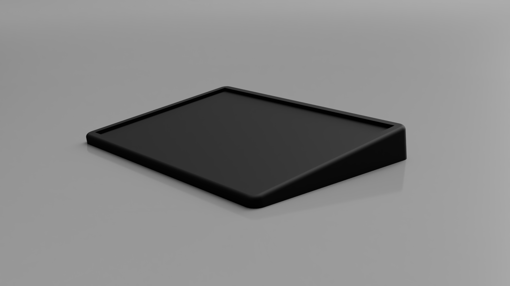

# QMK Macropad

I recently got into custom mechanical keyboards. Since these can get quite expensive to make I decided to first buy a small switch tester to see which mechanical switch I would like the most. When I got it and tested the different switches I thought it would be quite wasteful to only use this tester once and then let it collect dust forever, so I decided to make it into a handwired macropad.

This macropad is still a work in progress.

## Goals

-   Fully programmable with multiple layers (QMK)
-   Easy switching between layers with a small button
-   Display info about the current layer or other things on an OLED screen

## Layouts

The layout of the switch tester is 5 columns by 4 rows.

### Blank

### Numpad + macros

WIP

### Gamepad

WIP

## Housing

I also want to make a small 3D-printed housing for the switche tester since it's just a piece of acrylic with holes for the switches. The housing angles the acrylic plate at 7 degrees and adds an extra compartment for the OLED screen and layer switch. It should also be able to contain the other hardware. Right now it's still a work in progress.

## Parts

| Part name                                                                                                             | Price  |
| --------------------------------------------------------------------------------------------------------------------- | :----: |
| [KBDfans tactile switch tester](https://www.aliexpress.com/item/32917884682.html) (Seems to be unavailable right now) | €19,61 |
| [Arduino Pro Micro clone](https://www.aliexpress.com/item/32768308647.html)                                           | €3,10  |
| [OLED screen](https://www.aliexpress.com/item/32777216785.html)                                                       | €1,55  |
| [Diodes](https://www.aliexpress.com/item/4000142272546.html)                                                          | €0,68  |

_The list is excluding shipping cost and prices may change over time. Some parts (like the diodes) were purchased more than what I need so I would have some spares/stock._

## Wiring

I first designed the wiring in [Fritzing](https://fritzing.org/) before doing the actual soldering.

## Firmware

The firmware of the macropad is made with QMK.

WIP

## Useful links

-   [Geekhack handwire guide](https://geekhack.org/index.php?topic=87689.0)
-   [QMK handwire guide](https://beta.docs.qmk.fm/using-qmk/guides/keyboard-building/hand_wire)
-   [Pro Micro pinout](https://www.reddit.com/r/olkb/comments/5s8q76/help_pro_micro_pinout_for_qmk/)
-   [Keyboard layout editor](http://www.keyboard-layout-editor.com/#/)

## Build log
### 07/07/2020
The tester arrived and the idea to make the macropad was born.

