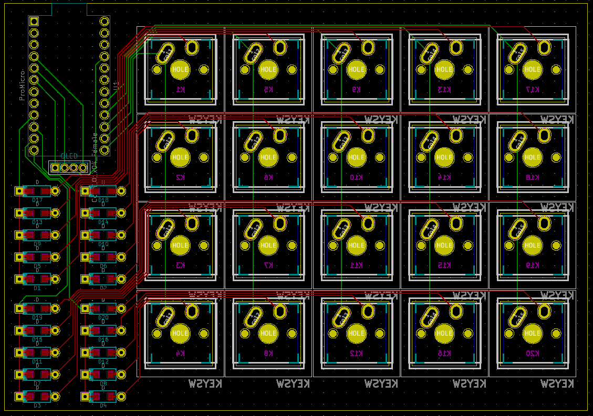

# QMK Macropad

I recently got into custom mechanical keyboards. Since these can get quite expensive to make I decided to first buy a small switch tester to see which mechanical switch I would like the most. When I got it and tested the different switches I thought it would be quite wasteful to only use this tester once and then let it collect dust forever, so I decided to make it into a ~~handwired~~ macropad with a custom pcb.

This macropad is still a work in progress.

## Goals

-   Fully programmable with multiple layers (QMK)
-   Display info about the current layer or other things on an OLED screen

## Firmware

The firmware of the macropad is made with QMK.
### Layouts

The layout of the switch tester is 5 columns by 4 rows.

#### Numpad + macros

#### Gamepad

## Housing

I also want to make a small 3D-printed housing for the macropad. The housing angles the switches at 7 degrees and adds some extra space to show the pro micro and oled screen. Right now it's still a work in progress.

## Parts

| Part name                                                                                                             | Price  |
| --------------------------------------------------------------------------------------------------------------------- | :----: |
| [KBDfans tactile switch tester](https://www.aliexpress.com/item/32917884682.html) (Seems to be unavailable right now) | €19,61 |
| [Arduino Pro Micro clone](https://www.aliexpress.com/item/32768308647.html)                                           | €3,10  |
| [OLED screen](https://www.aliexpress.com/item/32777216785.html)                                                       | €1,55  |
| [Diodes](https://www.aliexpress.com/item/4000142272546.html)                                                          | €0,68  |
| Custom PCB                                                                                                            | €6,21  |

_The list is excluding shipping cost and prices may change over time. Some parts (like the diodes) were purchased more than what I need so I would have some spares/stock._

## Wiring

~~I first designed the wiring in [Fritzing](https://fritzing.org/) before doing the actual handwire soldering.~~ The soldering idea was scrapped after I discoverd that you could design your own pcbs.

## Useful links

-   [Geekhack handwire guide](https://geekhack.org/index.php?topic=87689.0)
-   [QMK handwire guide](https://beta.docs.qmk.fm/using-qmk/guides/keyboard-building/hand_wire)
-   [Pro Micro pinout](https://www.reddit.com/r/olkb/comments/5s8q76/help_pro_micro_pinout_for_qmk/)
-   [Keyboard layout editor](http://www.keyboard-layout-editor.com/#/)

## Build log

### 07/07/2020

The tester arrived and the idea to make the macropad was born.

### 23/07/2020

While waiting for the other parts to arrive I discoved the wondrous world of pcb designing. I took on the challenge and after a few day I managed to design and order my very first custom pcb. The layout was inspired by the Discipline keyboards. These pcbs will take a few weeks to arrive, but I've already been waiting for weeks anyways on the other parts.

### 28/07/2020

All the parts I originally ordered have arrived (the Arduino Pro Micro, OLED screen & diodes). Now it's just a matter of waiting another few weeks for the pcb.

### 10/08/2020

The pcb's finally arrived too, now it's time to put everything together at last.

Since I designed it to just have through hole components, this went fairly easy for most parts. When soldering with through hole components, it's always smart to start with the smallest components first. So, first it was time for the diodes and the Arduino Pro Micro clone.

After that it was time to solder the switches. This also went pretty smoothly. For the plate mounted switches (those with only 3 instead of 5 pins) I used the original acrylic plate to hold them in the correct position on the pcb. The macropad sure looks pretty great already.

I first made the QMK firmware with [Keyboard Firmware Builder](https://kbfirmware.com/) to test if all the switches and the pcb works, which they luckily all did.

**OLED**
Now it was finally time to solder the OLED screen, which sadly came with multiple problems.

Firstly, the i2c pins were wired in reverse order to the Pro Micro. This was due to some wrong labels on the Kicad model. I "luckily" already realised this before the pcb's arrived, so i came up with the plan to just twist the 2 pins on the screen pcb so they get soldered in reverse.

The second problem was completely my fault, I misjudged the size of the 4 pin connector, which was way too small for the screens pcb pins. I fixed this by cutting the legs of the pcb to half their normal size and using the cut off diode legs as new, thinner pins.

However, this was not the end of the problems. After adapting the earlier made firmware to support an OLED screen it would display nothing. I spent a whole evening trying to fix code untill eventually desoldered the screen from the macropad pcb, where I discovered that 2 of the diode leg pins had come loose. This however was a problem for tomorrow.

### 11/08/2020

After carefully removing the solder and pins from the macropad pcb, with a burnt finger as souvenir, and resoldering new pins to the screen pcb the screen finally worked. I also added some cable insulation to the bare pins so they wouldn't short. This was sadly still not the end of my problems with the screen, since now the rendering on the screen wouldn't work properly. Drawings would render completely, but for text it would only render the bottom half.

